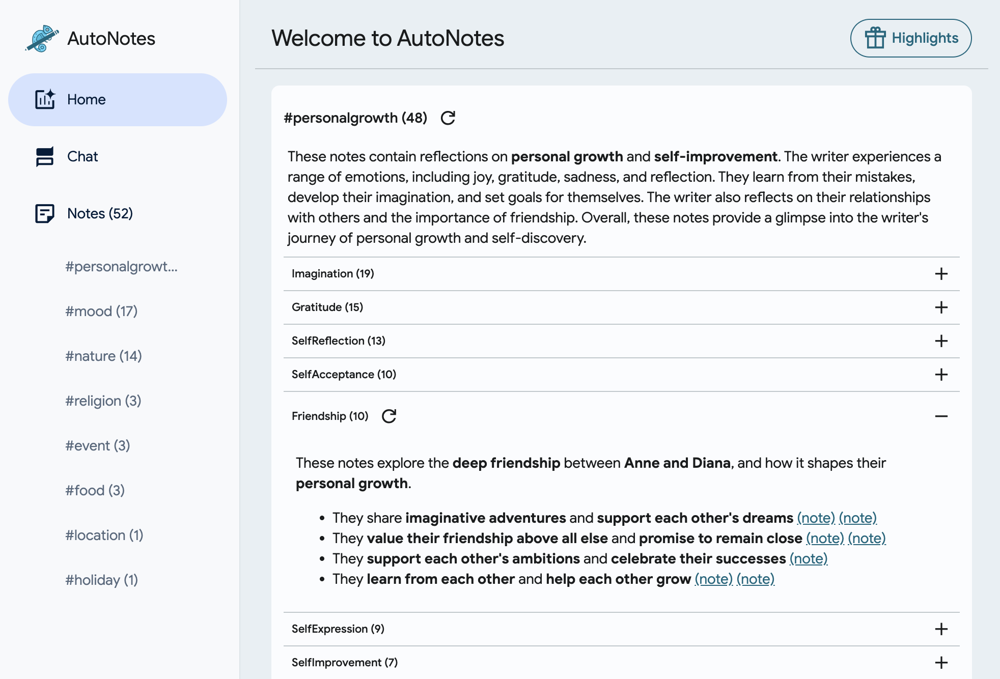
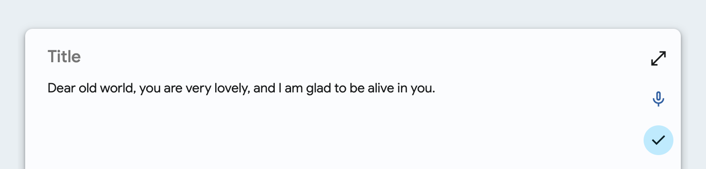
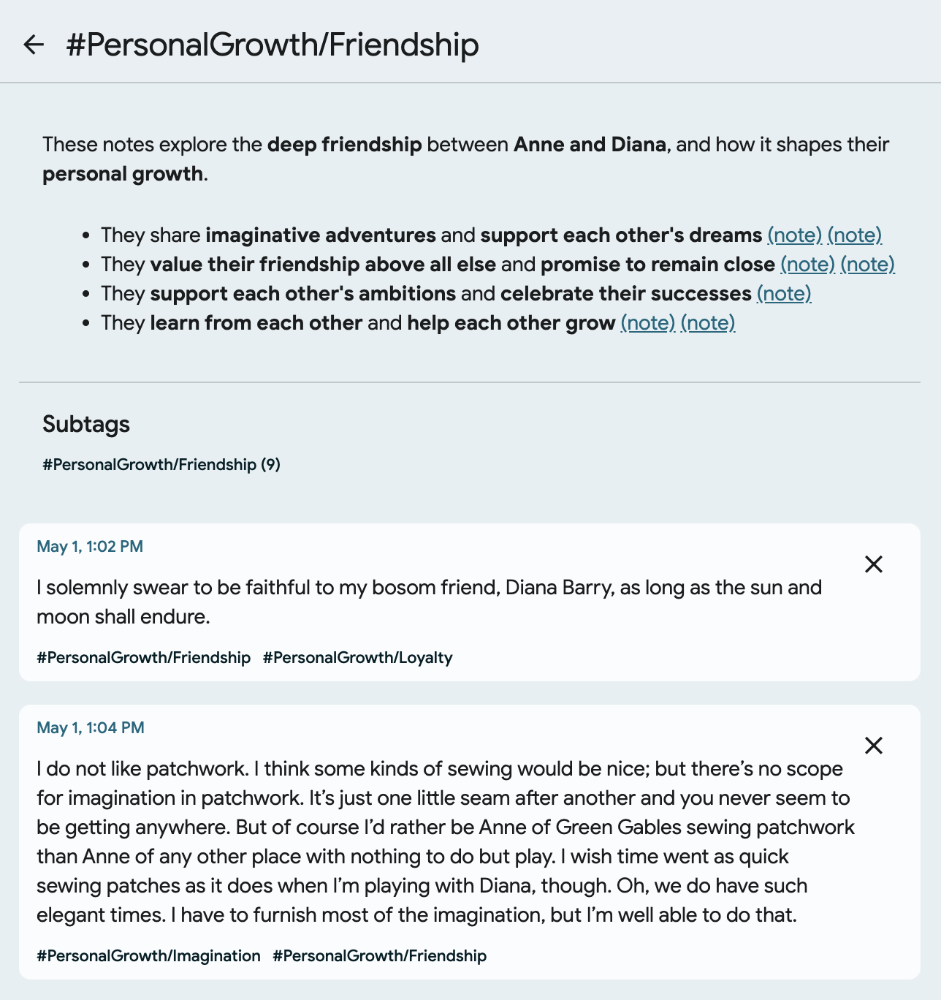
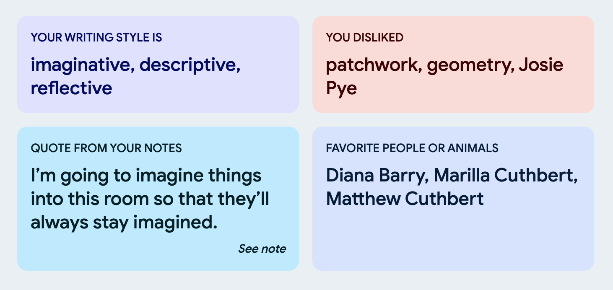
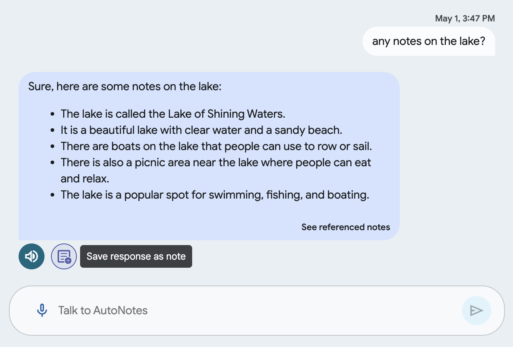

# 👋 Welcome to AutoNotes

AutoNotes is a experimental prototype for AI-powered notetaking.
Features include:

- 📝 Import/create and auto-tag notes
- 🔎 View summaries and other insights across your notes
- 🙋 Chat with your notes (via Gemini)



## Using AutoNotes

You can try AutoNotes at https://pair-code.github.io/autonotes.

To get started quickly, choose one of our example projects in the onboarding
flow:

- 🍬 Whimsical notes adapted from *Alice's Adventures in Wonderland*
- 🥕 Vivid journal entries adapted from *Anne of Green Gables*

You can change or create new projects under `Settings > Manage projects`.

If you'd like to use your own content, start with a blank project.

### 📝 Adding and auto-tagging notes

#### Importing existing notes

Under `Settings > Import`, import
Markdown files (e.g., exported from Obsidian) or Google Keep JSON files
(exported from [Google Takeout](https://takeout.google.com/)).

To apply AutoNotes organization to these notes, use the `Auto-tag notes`
and `Generate summaries` options in Settings (above the import section).

> NOTE: Tagging and summarization require an AI Studio Gemini API key
(see "Calling the Gemini API" below)

#### Creating new notes

Navigate to the `Notes` page and use the microphone or keyboard to capture a
note (in Markdown) at the bottom of the screen.



You can apply your own tags using the `#tag` format;
if you do not specify any tags, AutoNotes will auto-tag your notes.

> NOTE: To auto-tag new notes, AutoNotes requires an AI Studio Gemini API key
(see "Calling the Gemini API" below)

### 🔎 Viewing insights

Once your notes are tagged, you'll be able to see and click on top-level
categories in the sidebar of the app (desktop view).

For a deeper look at tags + summaries, navigate to the `Home` page. Use the
`+` icon to expand summaries for tag subcategories, or click directly on a tag
to view all associated notes.

If a summary is not shown, click the replay/redo arrow icon to generate it.

Click directly on a tag to view all associated notes.



> NOTE: Generating summaries requires an AI Studio Gemini API key
(see "Calling the Gemini API" below)

Finally, navigate to `Highlights` (gift icon) for a fun recap of your notes.
This feature works better when your project contains
descriptive content (as opposed to grocery lists or other brief reminders),
but we hope it's fun regardless 🎁



### 🙋 Chatting with your notes

Navigate to the `Chat` page and use the microphone or keyboard to send a
chat message. This can be a question about your notes (e.g., "What books
did I want to read?"), a general question (e.g., "Can you recommend a book
similar to Alice in Wonderland?"), or a combination of the two (e.g.,
"Can you recommend a book similar to the ones on my reading list?").

> NOTE: Chatting requires an AI Studio Gemini API key
(see "Calling the Gemini API" below)



If the response is based on your notes, you can click "See referenced notes"
to view those notes.

You can also convert the response to a new note by clicking the
"Save response as note" icon under the chat bubble (visible on hover).

## Calling the Gemini API

AutoNotes uses Gemini Pro via the AI Studio Gemini API to tag notes, respond
to chat messages, and generate tag summaries and other insights.
([View Gemini API pricing information](https://ai.google.dev/pricing))

> NOTE: AI Studio is only available in
[certain regions](https://ai.google.dev/gemini-api/docs/available-regions#available_regions).

To set this up, follow
[AI Studio instructions](https://ai.google.dev/gemini-api/docs/api-key)
to generate an API key.

Then, navigate to the AutoNotes Settings page and paste your API key in the
"Gemini API Key" field.

## Deleting data

AutoNotes is a client-side experiment: any data you save is kept in local
storage on your device (not sent to a server).

To clear this data, navigate to `Settings`:

Per-project: You can clear prompt call history
(`Manage model call history`), notes (`Clear notes`), and
chat history (`Clear chat history`) for the current project and use
`Manage projects` to switch between projects.

All data: At the bottom of the page, you can click `Delete all data` to clear
all content stored on your local device, including projects, API key,
and other settings.

## Running AutoNotes locally

To run AutoNotes locally:

```
git clone https://github.com/PAIR-code/autonotes.git
cd autonotes

npm install
npm run start
````

## License and Disclaimer
All software is licensed under the Apache License, Version 2.0 (Apache 2.0).
You may not use this file except in compliance with the Apache 2.0 license.
You may obtain a copy of the Apache 2.0 license at:
https://www.apache.org/licenses/LICENSE-2.0. 

Unless required by applicable law or agreed to in writing, all software and
materials distributed here under the Apache 2.0 licenses are distributed on an
"AS IS" BASIS, WITHOUT WARRANTIES OR CONDITIONS OF ANY KIND, either express or
implied. See the licenses for the specific language governing permissions and
limitations under those licenses.

This is not an official Google product.

AutoNotes is a research experiment by a small team and is not being
actively maintained.

Copyright 2024 DeepMind Technologies Limited.

## Acknowledgments
AutoNotes was designed and built by Ellen Jiang, Vivian Tsai, Aaron Donsbach,
Alejandra Molina, and Adam Connors.

Special thanks to James Wexler, Mahima Pushkarna, Michael Xieyang Liu,
Jeff Gray, Ian Li, Alberto Lalama, Grady Simon, Michael Terry, and Lucas Dixon
for making this experiment possible!
